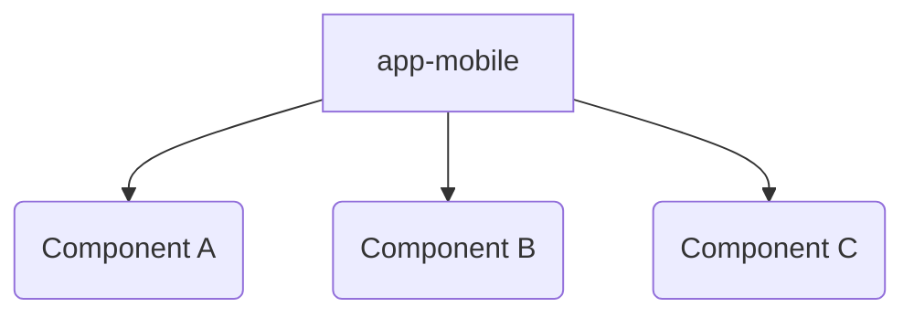

# Assumptions
- Project is React Native
- Project is checked in as a monorepo
- Yarn is used to leverage yarn workspaces

# Purpose
This project demonstrates one way to version components inside a React Native monorepo.  It is capable of supporting local or remote modules (e.g. npm, github packages)

One key goal is to understand how work in progress (WIP) code can be supported in trunk based development.  Similar to how feature toggles can support latent code (albeit by conditionals), versioning within workspaces can also support WIP by having the released app point to a published package while the WIP code lives locally, unpublished, in the codebase.  

Patterns/workflows for how to best work with local and or remotely published modules is outside the scope of this effort.

# Setup

- Make sure you have yarn 1
- Clone the project
- Run `yarn install`
- Run `yarn start`
- Install android or iOS binary to the device and launch
    - for this specific work android was tested

# Project Structure

The application logic is in app-mobile and it consumes three components a, b, and c.  

Each listed directory below is a node module in a workspace, thus each has a package.json.

- app-mobile
- packages
    - component-a
    - component-b
    - component-c



The modules in this demo do nothing more than output what module version they are running.

# Findings

## Givens
1. The app-mobile module acts as the project's entry point
2. The project has node modules A, B, and C, all of which are react native components.
3. Component A v3.0.0 was published in npm 
4. Component A v3.1.0 is unpublished but it's the latest checked in code for the module

## Questions
1. Can I point to the local, unpublished, version of a component?
   1. Yes, the local version can be referenced via app-mobile's package.json
      1. `yarn workspace app-mobile add @dfs-demo/component-a@3.1.0`
2. Can I point to a published version of a component, essentially ignoring the local/checked in component?
   1. Yes, a version published to a package manager can be referenced via app-mobile's package.json
      1. `yarn workspace app-mobile add @dfs-demo/component-a@3.0.0`
      2. This means the local version is unused by the project
      3.  ```mermaid
          graph TD
          App[app-mobile] --> |remote| A(Component A v3.0.0)
          A2(Local Component A v3.1.0)
          ```
3. Can I point to multiple versions, both remotely published and locally unpublished, of a component?
   1. Sort of, but it becomes mentally complex.
   2. While each package.json can only point to a single version of a module, transient dependencies may cause your project to reference different versions of the same module.
   3. Keep in mind just becaue something is possible doesn't mean it should be done, the downside here is the permutations of component relationships may be difficult to test and to understand.
   4. Example of using local & remote, here component B's package.json would have declared v3.0.0 while C & app-mobile's package.json declared v3.1.0 of component A.
        ```mermaid
        graph TD
            App[app-mobile] -->|local|A(Component A)
            App[app-mobile] -->|local|B(Component B)
            App[app-mobile] -->|local|C(Component C)
            B --> |remote|A1(Component A v3.0.0)
            C --> A
        ```
4. Do I have to manage multiple versions of each component across multiple package.json files?
   1. Probably, this is the relationship I expected but not what I experienced when using peerDependencies
        ```mermaid
        graph TD
            App[app-mobile] -->|remote|A(Component A v3.0.0)
            App[app-mobile] -->|local|B(Component B local)
            App[app-mobile] -->|local|C(Component C local)
            B --> |remote|A
            C --> |remote|A
        ```
   2. This is what I experienced
        ```mermaid
        graph TD
            App[app-mobile] -->|remote|A(Component A v3.0.0)
            App[app-mobile] -->|local|B(Component B)
            App[app-mobile] -->|local|C(Component C)
            B --> |local|A2(Component A v3.1.0)
            C --> |local|A2
        ```
   3. To address this I manually specified the version in each module WITHOUT using peerDependencies
        ```
        yarn workspace app-mobile add @dfs-demo/component-a@3.0.0
        yarn workspace @dfs-demo/component-b add @dfs-demo/component-a@3.0.0
        yarn workspace @dfs-demo/component-c add @dfs-demo/component-a@3.0.0
        ```

More research is likely required here to confirm if there are any other ways to set the version once in app-mobile/package.json and use peerDependencies/some other tool to reuse the same dependency from other workspace modules.
# Unexpected Findings
1. A library is required to make yarn workspaces + metro play nicely.
   1. This is because metro has it's own resolution process that isn't the same as node's resolution
   2.  ```
       "@rnx-kit/metro-config": "^1.2.38",
       "@rnx-kit/metro-resolver-symlinks": "^0.1.21",
        ```
   3. There may be caveats on larger projects or projects with custom configurations as metro.config.js also needs to be updated to support rnx-kit
   4. Surprisingly to me, if you only want to point to local versions of your code metro can work out of the box w/out yarn workspaces, but this doesn't support pointing to remote versions via a package manager.

# Future Possibilities

1. Taking these findings to the exterme, it may be possible to have a core app comprised of little more than a package.json file and a js entry point.  All dependencies could be their own local or published module.  
   1. Modules could individually be published.
   2. An app release would largely be bumping versions in the package.json, making a build, and deploying.
   3. Testing would be better scoped, i.e. to test module X you could largely take the existing prod app and bump only module X to assert things behave as expected. 
