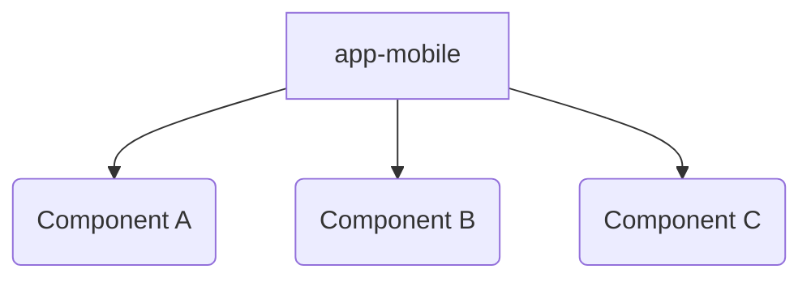

# Purpose
This project demonstrates versioned components within a React Native monorepo whether local or hosted in a package manager. 

The goal is to understand how one can point to a remote package manager for published code yet keep in-progress code local/unpublished in the repo.

# Setup

- Make sure you have yarn 1
- Clone project
- Run `yarn install`
- Run `yarn start`
- Install android or iOS binary to the device and launch
    - for this specific work android was tested

# Project Structure

The application logic is in app-mobile and it consumes three components a, b, and c.  
Each of the mentioned directories below is it's own node module (it's own yarn workspace) thus they each have a package.json
For the sake of this demo components a, b, and c simply return a string indicating what version of package.json they are.

- app-mobile
- packages
    - component-a
    - component-b
    - component-c



# Results

Given component A v3.0.0 is hosted in npm and v3.1.0 is currently the local version....

1. Can I point to the local version of my component?
   1. Yes, the local version can be referenced in package.json
      1. `yarn workspace app-mobile add @dfs-demo/component-a@3.1.0`
2. Can I point to a different version of my component?
   1. Yes, a version published to a package manager can be referenced in package.json
      1. `yarn workspace app-mobile add @dfs-demo/component-a@3.0.0`
      2. This results in the local version of the code for the component to be left unused
      3.  ```mermaid
          graph TD
          App[app-mobile] --> |remote| A(Component A v3.0.0)
          A2(Local Component A v3.1.0)
          ```
3. Can I point to multiple versions of the same component?
   1. Sort of, but it becomes mentally complex.
   2. While each package.json can only point to a single version of a module, via transient dependencies you could reference different versions of the same module.
   3. Keep in mind just becaue something is possible doesn't mean it should be done, the downside here is the permutations of component relationships may be difficult to test and to understand.
   4. 
        ```mermaid
        graph TD
            App[app-mobile] -->|local|A(Component A)
            App[app-mobile] -->|local|B(Component B)
            App[app-mobile] -->|local|C(Component C)
            B --> |remote|A1(Component A remote v3.0.0)
            C --> A
        ```
4. Do I have to manage multiple versions of each component across multiple package.json files?
   1. I was under the assumption that if one module's package.json defined the dependencies and their versions, the other dependent modules could simply list peerDependencies with a wildcard and in that way the single package.json would drive all version numbers.
      1. I envisioned this where app-mobile would drive the version number of component A in it's own package.json
        ```mermaid
        graph TD
            App[app-mobile] -->|remote|A(Component A v3.0.0)
            App[app-mobile] -->|local|B(Component B local)
            App[app-mobile] -->|local|C(Component C local)
            B --> |remote|A
            C --> |remote|A
        ```
      2. In reality I got this when a higher version existed local than in npm
        ```mermaid
        graph TD
            App[app-mobile] -->|remote|A(Component A v3.0.0)
            App[app-mobile] -->|local|B(Component B)
            App[app-mobile] -->|local|C(Component C)
            B --> |local|A2(Component A v3.1.0)
            C --> |local|A2
        ```
      3. To address this I had to manually specify the desired version in each module
            ```
            yarn workspace app-mobile add @dfs-demo/component-a@3.0.0
            yarn workspace @dfs-demo/component-b add @dfs-demo/component-a@3.0.0
            yarn workspace @dfs-demo/component-c add @dfs-demo/component-a@3.0.0
            ```
# Unexpected Findings
1. A library is required to make yarn workspaces + metro play nicely.
   1. This is because metro has it's own resolution process that isn't the same as vanilla node
   2.  ```
       "@rnx-kit/metro-config": "^1.2.38",
       "@rnx-kit/metro-resolver-symlinks": "^0.1.21",
        ```
   3. There may be caveats on larger projects or projects with custom configurations as metro.config.js also needs to be updated to support rnx-kit
   4. Surprisingly to me, if you only want to point to local versions of your code metro can work out of the box w/out yarn workspaces.

# Future Possibilities

1. Taking these findings to the exterme, it may be possible to have a core app comprised of little more than a package.json file and a js entry point.  All dependencies could be their own local or published module.  
   1. Modules could individually be published
   2. An app release would largely be bumping versions in the package.json, making a build, and deploying.
   3. Testing would be better scoped, i.e. to test module X you could largely take the existing prod app and bump only module X to assert things behave as expected. 
