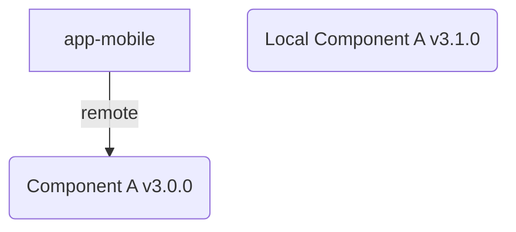
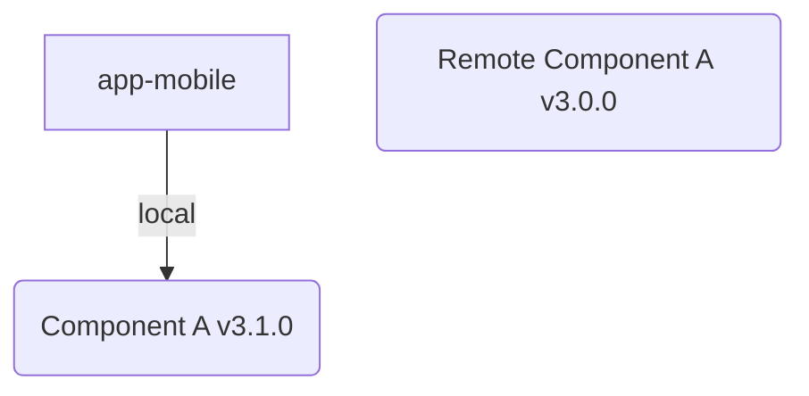
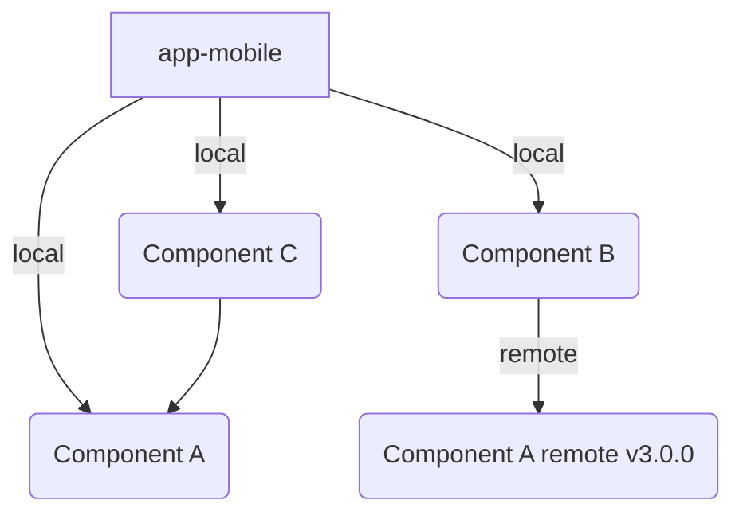
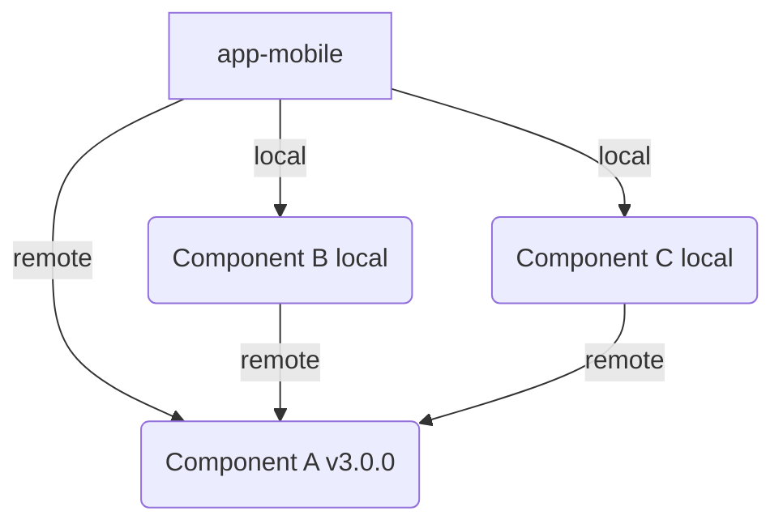
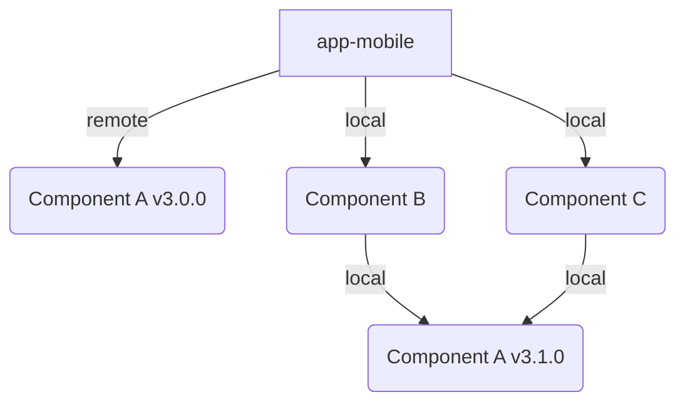

# Purpose
This project demonstrates using versioned component within a React Native monorepo. 

The goal is to understand how one can point to a remote package manager for published code yet keep in-progress code local in the repo.

To take it to the extreme, the content in app-mobile could largely just be a package.json file pointing to all dependencies.  A release to prod could be little more than making sure all versions are correct.

# Setup

- Make sure you have yarn 1
- Clone project
- Run `yarn install`
- Run `yarn start`
- Install binary to device (android tested) and launch

# Output

## Using Remote

By default you'll see the app reference the remote component A *v3.0.0) pulled from npm instead of the local version of component A (v3.1.0)



This is because the app's package.json references `"@dfs-demo/component-a": "3.0.0"`, had it referenced 3.1.0 it would have used the local version instead of checking for a remote match.

In this way we can publish a stable release of a module as version X, continue to work on it as version Y, but keep the app pointed to vX until we're ready to release.  The dev can PR changes to the component to the trunk, and not until package.json is bumped to reference vY will the chagnes be consumed, despite living in the same repo.

## Using Local

If we instead wanted to point local we could change the version to a wildcard `"@dfs-demo/component-a": "*"` or exact match `"@dfs-demo/component-a": "3.1.0"`.  Now the remote version sits out on npm (or another package manager) unused by our app.



## Using a mix of remote & local versions

Just because something is possible doesn't mean it should be done, but if desired various components could each leverage different versions.  This quickly turns into a complex mental model (app-mobile & C use A v0.3.0, B uses A v3.0.0) with many package.json files referencing many different versions.  This also likely makes testing complex due to permutations of component versions.




## Single version source of truth using peerDependencies

This isn't working as desired. 

Ideally each componenet references a peer dependency and lets the app's package.json drive the version. 



That is I'd expect the following to set the version to use the remote 3.0.0 version for all packages.

```
 yarn workspace app-mobile add @dfs-demo/component-a@3.0.0
```

Instead I'm getting




The other packages (component B & C) using peerDependencies of  component a as "*" resolve to using the local 3.1.0 version (undesired).  To address this I had to run the following.

```
 yarn workspace app-mobile add @dfs-demo/component-a@3.0.0
 yarn workspace @dfs-demo/component-b add @dfs-demo/component-a@3.0.0
 yarn workspace @dfs-demo/component-c add @dfs-demo/component-a@3.0.0
```

## Note
While node + yarn workspaces play nicely out of the box, the expected behavior (using the version # of the package defined, even if remote) was not working in React Native + yarn workspaces until I added the following to package.json and updated the metro.config.json file
```
    "@rnx-kit/metro-config": "^1.2.38",
    "@rnx-kit/metro-resolver-symlinks": "^0.1.21",
```

This is because how the metro bundler packaged with react native resolves modules.  In fact even without yarn workspaces, metro is capable of resolving all local dependencies.   By adding the rnx-kit dependencies the metro bundler does start resolving dependencies as expected based on package.json.

One caveat of this is larger projects with other customs changes to metro.config.js may have some more investigation/configuration to do before this works for them.
